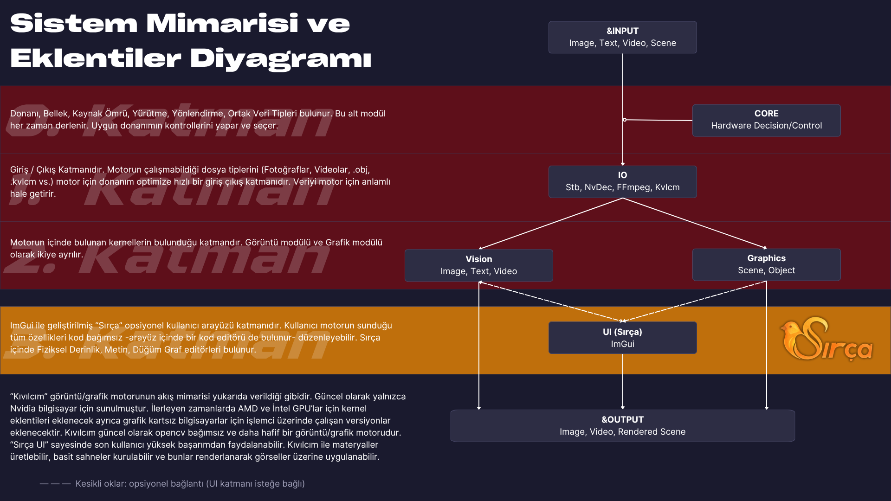
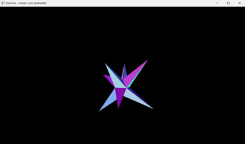

# CudaVisionEngine 🚀

Yüksek performanslı, donanım hızlandırmalı görüntü işleme, video işleme ve
grafik motoru. Piksel verilerini ve matematiksel operasyonları doğrudan GPU
belleğinde işlemek için CUDA C++ ile geliştirilmektedir.

Proje; çekirdek kaynak yönetimini, veri giriş/çıkışını, görüntü işlemeyi,
grafik üretimini ve kullanıcı arayüzünü ayrı CMake modüllerinde toplar.

## Proje mimarisi

#### Kıvılcım'ın temel veri akışı:


Buradaki `Input`; yalnızca görüntü değil, video, metin, sahne, model, proje
dosyası, stream veya bellek içi veri olabilir. UI motorun zorunlu parçası
değildir; Vision ve Graphics modülleri arayüz olmadan da kullanılabilir.

Ayrıntılı mimari kararlar için [mimari belgesine](mdSource/ARCHITECTURE.md) bakın.

## Modüller

| Modül | Sorumluluk                                                                    | Belge |
| --- |-------------------------------------------------------------------------------| --- |
| Core | Donanım kontrolü ve seçimi, CUDA bellek sahipliği, ortak kaynak yaşam döngüsü | [Core](mdSource/CORE.md) |
| Vision | Görüntü/video kernel'ları ve akıcı işlem zinciri                              | [Vision](mdSource/VISION.md) |
| IO | Görüntü, video, sahne, model ve stream giriş/çıkışı                           | [IO](mdSource/IO.md) |
| Graphics | Sahne, renderer, texture, shader ve parçacık sistemi                          | [Graphics](mdSource/GRAPHICS.md) |
| UI | Opsiyonel ImGui/Sırça kullanıcı arayüzü                                       | [UI](mdSource/UI.md) |

## Teknik yaklaşım

### GPU hızlandırma

Görüntü işleme operasyonları CUDA thread/block yapısına dağıtılır. Uygun
işlemlerde ara sonuçlar GPU belleğinde tutularak gereksiz CPU–GPU transferleri
azaltılır.

### Bellek yönetimi

Core modülü CUDA tahsislerini RAII tabanlı `CudaBuffer<T>` ile yönetir.
`CudaBufferView<T>` belleği sahiplenmeden başka bir modüle görünüm vermek için
kullanılır. Vision hangi çalışma buffer'larına ihtiyaç duyacağına karar verir;
Core yalnızca bunların güvenli yaşam döngüsünü sağlar.

### Modüler tasarım

Yüksek seviyeli işlemler `EngineFactory` üzerinden zincirlenebilir.
`OperationWrapper` ise kernel çağrılarını ve grid/block hesaplarını kapsayan
daha düşük seviyeli arayüzdür.

```cpp
engine.uploadFrame(input)
      .applyTemperature(0.15f)
      .rgbToHsv()
      .applyGamma(1.1f)
      .hsvToRgb()
      .downloadFrame(output);
```

Daha fazla ve kısa kullanım örneği için [Kullanım Rehberi](mdSource/USAGE.md)
sayfasına bakın.

## Özellikler

- RGB, HSV ve YUV renk uzayı dönüşümleri
- Parlaklık, sıcaklık, gamma, gölge ve parlak alan ayarları
- Box blur, Gaussian blur, sharpen, edge detection, Sobel ve emboss
- Renk izolasyonu ve renk değiştirme
- Retinex normalizasyonu
- 3D LUT uygulama
- Optical flow ve vektör alanı görselleştirmeleri
- FFmpeg demux ve NVIDIA NVDEC video çözme
- CUDA–OpenGL interoperability
- Sahne, model, materyal ve KVLCM yükleme
- 3D renderer, shader ve parçacık sistemi
- Opsiyonel ImGui tabanlı Sırça arayüzü



## Gereksinimler

- C++20 uyumlu derleyici
- CMake
- NVIDIA CUDA Toolkit 13.x
- OpenGL
- Windows üzerinde güncel NVIDIA sürücüsü

Proje şu anda NVIDIA/CUDA backend'i ile geliştirilmektedir. Gelecekteki AMD,
Intel veya CPU backend'leri ayrı hedefler olarak derlenecek; kullanılmayan
backend'in kaynaklarını derlemek zorunlu olmayacaktır.

## Derleme

```bash
cmake -S . -B cmake-build-debug -G Ninja -DCMAKE_BUILD_TYPE=Debug
cmake --build cmake-build-debug --target CudaVisionEngine
```

CLion kullanırken kök `CMakeLists.txt` proje kaynağı olarak seçilmeli ve Run
Configuration hedefi `CudaVisionEngine` olmalıdır.

## Third-party libraries

- [stb](https://github.com/nothings/stb) — görüntü okuma/yazma
- [GLFW](https://github.com/glfw/glfw) — pencere ve OpenGL context yönetimi
- [Dear ImGui](https://github.com/ocornut/imgui) — kullanıcı arayüzü
- [FFmpeg](https://ffmpeg.org/) — video demux ve medya altyapısı
- NVIDIA CUDA / NVDEC — GPU hesaplama ve donanım video çözme

## Belgeler

- [Kullanım Rehberi](mdSource/USAGE.md)
- [Mimari](mdSource/ARCHITECTURE.md)
- [Core](mdSource/CORE.md)
- [Vision](mdSource/VISION.md)
- [IO](mdSource/IO.md)
- [Graphics](mdSource/GRAPHICS.md)
- [UI](mdSource/UI.md)

